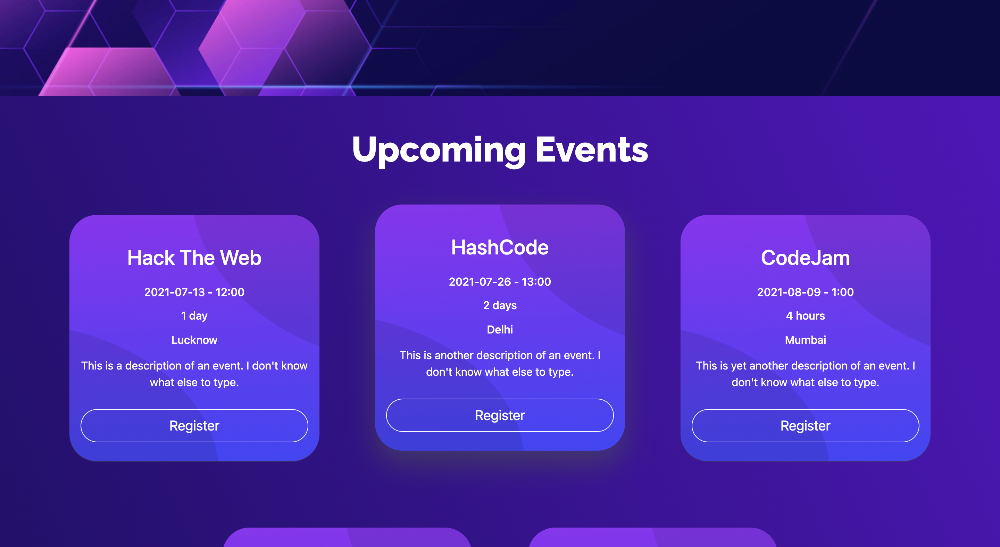
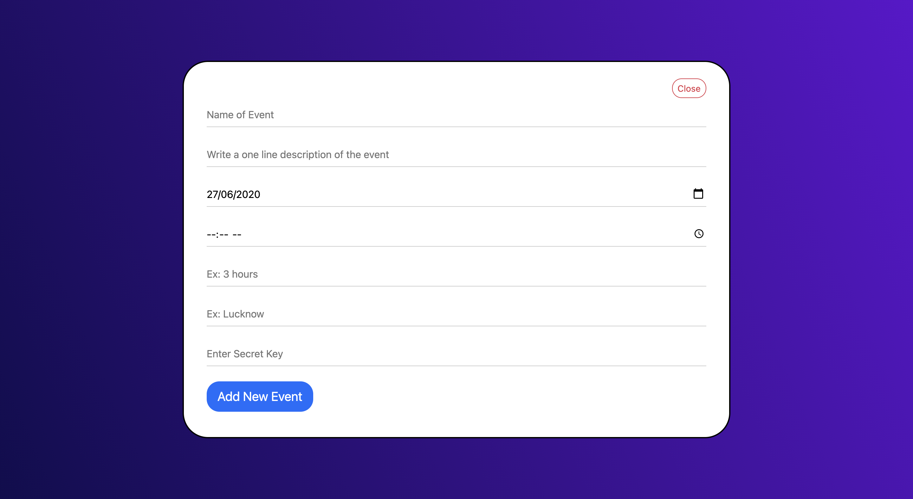

# event-manager

###Organize Engaging Events, Faster!!
This is a managing system – backed by open-source code – that helps you organize high-quality irresistible social experiences.

Check out the website [here](https://theanmolsharma.github.io/event-manager/).

Check out database [here](https://docs.google.com/spreadsheets/d/1xcVDnqSalHMXfze4QDnK6GqV1MRN8_HZaYFRD_Bttr8/edit?usp=sharing).

## Motivation

Major motivation, and the reason I used [Vue.js](https://vuejs.org) for this project is because I recently started learning Vue. I am already familiar with React and this prior knowledge helped to learn concepts of [Vue.js](https://vuejs.org) easily.

I also recently saw a video on [Fireship's youtube](https://www.youtube.com/channel/UCsBjURrPoezykLs9EqgamOA) channel on how I can use [Google Sheets](https://docs.google.com/spreadsheets/u/0/) as a Database. I found this fascinating and decided that I will use [Google Sheets](https://docs.google.com/spreadsheets/u/0/) as a database in this project.

BitByte- The Programing Club of IIITDM Jabalpur organised a web development hackathon - Hack The Web which provided me the perfect opportunity to test my knowledge of Vue.js while allowing me to use Google Sheets as a database.



## Features
* Register for an Upcoming Event
* List of Past Event and Upcoming Events with all relevant details
* Admin can add new events in just 2 clicks
* Admin can add events by just providing a secret master key which will be integrated into URL while making request so that no one without secret key can access.
* Since there is no copy of the secret key stored anywhere, the system is highly secure.
* Since all data is directly stored on Google Sheets therefore it is easily accessible.

## Tech/Frameworks Used
* [Vue.js](https://vuejs.org)
* [Google Sheets API](https://developers.google.com/sheets/api)
* [SheetDB.io](https://sheetdb.io)



## Project setup
```
npm install
```

### Compiles and hot-reloads for development
```
npm run serve
```

### Compiles and minifies for production
```
npm run build
```

### Lints and fixes files
```
npm run lint
```

### Customize configuration
See [Configuration Reference](https://cli.vuejs.org/config/).
